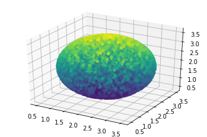

# vandervolume
Compute the van der Waal volume of molecules using brute-force MC simulated darts. Why? Because why not?

Usage:

    python vandervolume.py <input.xyz>

Change the parallel_flag from False to True if needed (example: very large molecules).

Default counter = 10000. Increase for larger molecules.

Example:

    > python vandervolume.py oxygen.xyz
    100%|██████████| 10000/10000 [00:00<00:00, 26070.65it/s]
    Approximate volume is 14.75

